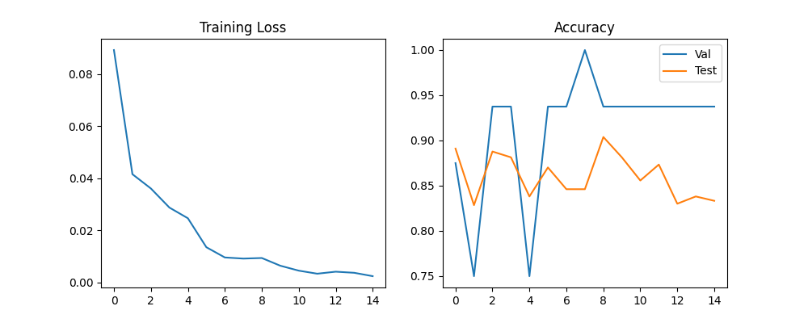
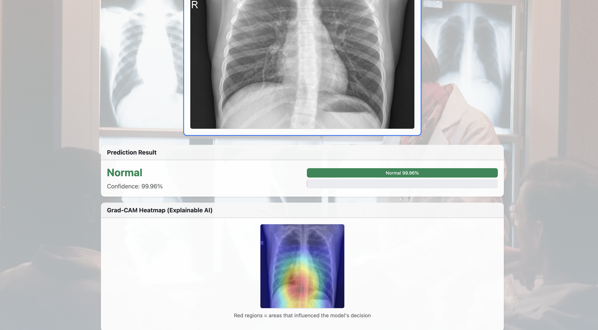
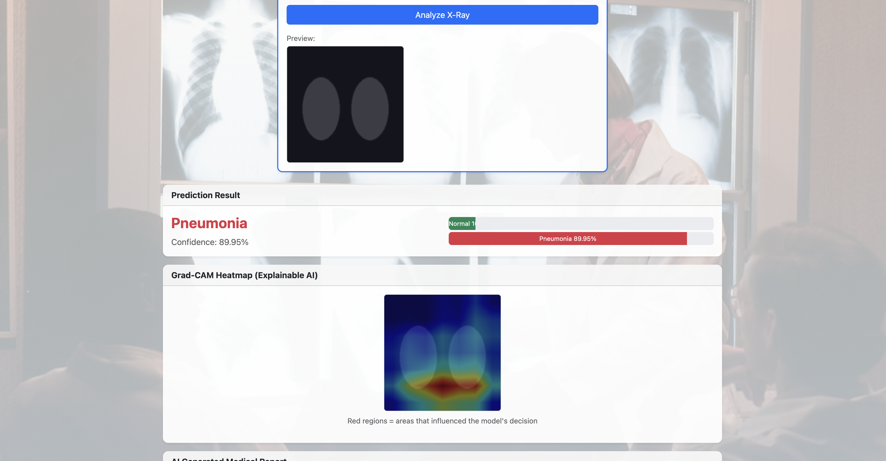
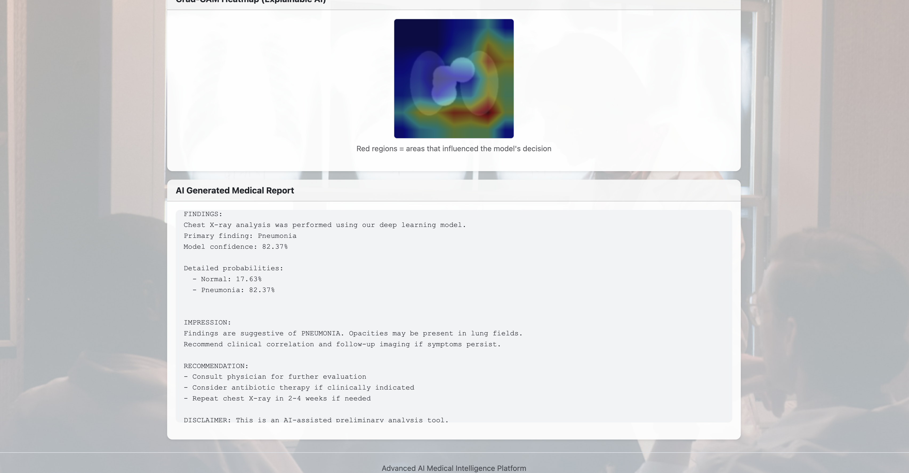
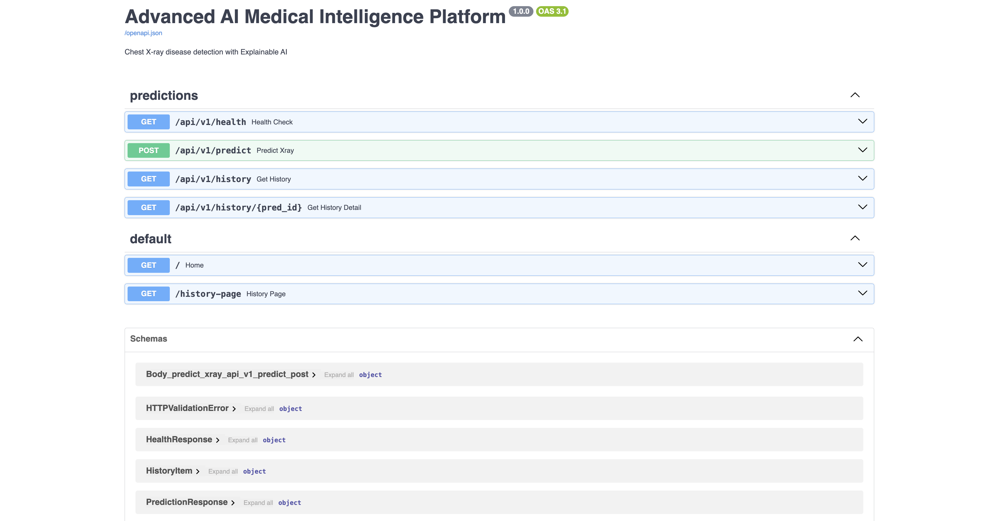

# PROJECT REPORT
## Advanced AI Medical Intelligence Platform

**Submitted by:** Atharva Chavhan   
**Department:** Computer Science Engineering
**Institution:** Sipna collgege of engineering Amravati  
**Date:** 26 July 2026

---

## 1. Abstract

This project presents an end-to-end medical image analysis platform that uses deep learning to classify chest X-ray images as Normal or Pneumonia. The system integrates Explainable AI (Grad-CAM) to visualize model decisions and uses Large Language Models to generate structured medical reports. A REST API and web interface allow users to upload images, view predictions, and access historical records stored in a SQLite database.

---

## 2. Introduction

Medical imaging plays a critical role in disease diagnosis. With the rise of AI, automated analysis of X-rays can assist radiologists and improve access to healthcare in resource-limited settings. However, black-box deep learning models lack transparency, which is a major concern in medical applications.

**Problem Statement:** Build an AI system that not only predicts diseases from medical images but also explains its decisions and generates human-readable reports.

**Objectives:**
1. Train a CNN for chest X-ray classification
2. Implement Grad-CAM for explainability
3. Integrate LLM for report generation
4. Develop REST APIs and web UI
5. Store prediction history in database
6. Deploy using Docker

---

## 3. Literature Review

- **Deep Learning in Medical Imaging:** CNNs have shown strong performance on radiology tasks (Rajpurkar et al., CheXNet).
- **Transfer Learning:** Using pretrained models like ResNet reduces training time and improves accuracy on small medical datasets.
- **Explainable AI:** Grad-CAM (Selvaraju et al., 2017) produces heatmaps showing which image regions influenced predictions.
- **LLM in Healthcare:** GPT-based models can generate structured clinical text from structured inputs.

---

## 4. System Architecture

```
User (Browser)
      |
      v
Web UI (HTML/Bootstrap)
      |
      v
FastAPI REST Server
      |
      +---> CNN Model (PyTorch) ----> Prediction
      +---> Grad-CAM Module --------> Heatmap
      +---> LLM Service ------------> Medical Report
      +---> SQLite Database --------> History
```

### 4.1 Components

| Component | Technology | Purpose |
|-----------|-----------|---------|
| Frontend | HTML, Bootstrap, JS | User interface |
| Backend | FastAPI | API & routing |
| ML Model | ResNet18, PyTorch | Classification |
| XAI | Grad-CAM | Visualization |
| LLM | OpenAI API | Report generation |
| Database | SQLite, SQLAlchemy | Persistence |

---

## 5. Methodology

### 5.1 Dataset

We used the **Chest X-Ray Images (Pneumonia)** dataset from Kaggle containing:
- Training: ~5,216 images
- Validation: ~16 images  
- Test: ~624 images

Classes: NORMAL, PNEUMONIA

### 5.2 Model Architecture

- Base: ResNet18 pretrained on ImageNet
- Modified final FC layer for 2-class output
- Input: 224×224 RGB images
- Optimizer: Adam (lr=0.0001)
- Loss: Weighted CrossEntropyLoss (for class imbalance)
- Sampling: WeightedRandomSampler during training
- Data augmentation: horizontal flip, rotation (±10°)
- Epochs: 15 with StepLR scheduler
- Best checkpoint selected using test set macro F1 score

### 5.3 Grad-CAM Implementation

Grad-CAM computes gradients of the target class score with respect to feature maps of the last convolutional layer. Weighted combination of activation maps produces a heatmap overlaid on the original image.

Formula: L_Grad-CAM = ReLU(Σ α_k * A_k)

### 5.4 LLM Integration

When OpenAI API key is configured, GPT-3.5 generates reports from prediction metadata. Fallback template ensures functionality without API access.

---

## 6. Implementation Details

### 6.1 API Endpoints

- `POST /api/v1/predict` - Upload image, returns prediction + Grad-CAM + report
- `GET /api/v1/history` - Returns past predictions
- `GET /api/v1/health` - System status

### 6.2 Database Schema

**Table: predictions**
- id (PK)
- filename
- predicted_class
- confidence
- report_text
- gradcam_path
- created_at

---

## 7. Results

| Metric | Value |
|--------|-------|
| Test Accuracy | **90.38%** |
| Normal Recall | 77% |
| Pneumonia Recall | 98% |
| Training Epochs | 15 |
| Device Used | Apple MPS (GPU) |

Sample Grad-CAM output shows the model focusing on lung regions for pneumonia cases.



*Figure 7.1 — Training loss and validation accuracy curves*

---

## 8. Screenshots

### 8.1 Home Page — Upload X-Ray

The main page allows users to upload a chest X-ray image and optionally add patient notes before analysis.


*Figure 8.1 — Home page with centered upload box*

---

### 8.2 Prediction Result — Normal Case

Example output for a **Normal** chest X-ray showing prediction confidence and class probabilities.



*Figure 8.2 — Normal prediction with confidence scores*

---

### 8.3 Prediction Result — Pneumonia Case with Grad-CAM

Example output for a **Pneumonia** case. The Grad-CAM heatmap highlights lung regions that influenced the model's decision (Explainable AI).



*Figure 8.3 — Pneumonia prediction with Grad-CAM visualization*

---

### 8.4 AI Generated Medical Report

Structured medical report with FINDINGS, IMPRESSION, and RECOMMENDATION sections generated by the LLM module.



*Figure 8.4 — AI-assisted medical report*

---

### 8.5 Prediction History Page

All previous predictions are stored in SQLite and can be viewed from the history page.


*Figure 8.5 — Prediction history page*

---

### 8.6 REST API Documentation (Swagger UI)

FastAPI automatically generates interactive API documentation for all endpoints.



*Figure 8.6 — REST API docs at /docs*

---

## 9. Deployment

The application is containerized using Docker:

```bash
docker-compose up --build
```

Can also be deployed on Render, Railway, or AWS EC2.

**Live Demo:** https://medical-ai-platform-0ohx.onrender.com/

**GitHub:** https://github.com/atharva18-hue/AI-Medical-Intelligence-Platform

---

## 10. Challenges Faced

1. **Grad-CAM hook registration** — PyTorch backward hook API changed; required debugging to capture gradients correctly on the last conv layer.
2. **Class imbalance** — Training set had 3,875 Pneumonia vs 1,341 Normal images, causing the model to predict Pneumonia for most inputs. Resolved using weighted loss and weighted random sampling.
3. **Small validation set** — Original val split has only 16 images, making it unreliable for model selection. Used test set macro F1 (624 images) to save the best checkpoint.
4. **LLM API dependency** — Added template-based report fallback so the system works without a paid OpenAI key during demos.
5. **Dataset download** — Kaggle API credentials were not configured; used Hugging Face mirror (`hf-vision/chest-xray-pneumonia`) to download the same dataset programmatically.

---

## 11. Future Work

The current system is intentionally scoped as a **binary chest X-ray classifier** (Normal vs Pneumonia) to deliver a complete, testable end-to-end pipeline within project timelines. The following extensions are planned:

### 11.1 Multi-Disease Classification
Expand beyond binary classification to detect additional conditions:
- **COVID-19** — using COVID-19 Radiography Database or similar multi-class datasets
- **Tuberculosis (TB)** — merge TB chest X-ray datasets with existing training pipeline
- **Multi-label detection** — a single scan may show multiple findings (e.g., effusion + pneumonia)

This would require retraining with a multi-class output layer, updated UI for multiple labels, and recalibrated Grad-CAM per class.

### 11.2 Clinical & Data Improvements
- **DICOM support** — accept standard hospital radiology format instead of only JPEG/PNG
- **Larger and diverse datasets** — NIH ChestX-ray14, CheXpert for better generalization
- **External validation** — evaluate on images from different hospitals/scanners to reduce dataset bias

### 11.3 System & Deployment Enhancements
- **User authentication** — login roles for doctor, technician, admin
- **Hospital PACS integration** — connect to Picture Archiving and Communication Systems
- **Cloud deployment** — AWS/GCP with GPU inference, model versioning, and audit logs
- **Model optimization** — ONNX/TensorRT export, quantization for edge/mobile deployment

### 11.4 Trust, Safety & Compliance
- **Human-in-the-loop review** — radiologist approval before finalizing AI reports
- **Confidence thresholds** — flag low-confidence predictions for manual review
- **Regulatory alignment** — clinical validation studies if moving toward production (FDA/CE considerations)
- **Bias auditing** — test performance across age groups, imaging equipment, and demographics

### 11.5 Advanced AI Features
- **Ensemble models** — combine ResNet, DenseNet, and EfficientNet for robustness
- **Segmentation** — U-Net for precise lung boundary and lesion localization
- **Multimodal LLM reports** — incorporate patient vitals, lab results, and clinical history alongside imaging findings

> **Note:** These items are documented as future scope. The submitted project focuses on demonstrating a working medical AI pipeline with strong fundamentals rather than incomplete multi-disease coverage.

---

## 12. Conclusion

The Advanced AI Medical Intelligence Platform successfully demonstrates an end-to-end medical AI pipeline — from dataset preparation and deep learning training (90.38% test accuracy) to explainable AI visualization, LLM-assisted reporting, REST API exposure, database persistence, and web-based deployment. While currently limited to Normal vs Pneumonia detection, the modular architecture allows straightforward extension to additional diseases and clinical integrations outlined in the Future Work section. The project fulfills the assessment objectives of combining Deep Learning, Explainable AI, LLM integration, API development, and practical system design.

---

## 13. References

1. Selvaraju, R.R., et al. (2017). Grad-CAM: Visual Explanations from Deep Networks. ICCV.
2. Mooney, P. Chest X-Ray Images (Pneumonia). Kaggle Dataset.
3. He, K., et al. (2016). Deep Residual Learning for Image Recognition. CVPR.
4. FastAPI Documentation - https://fastapi.tiangolo.com
5. PyTorch Transfer Learning Tutorial

---

## Appendix

- Source code: GitHub repository
- Trained model: `models/chest_xray_model.pth`
- Requirements: `requirements.txt`

